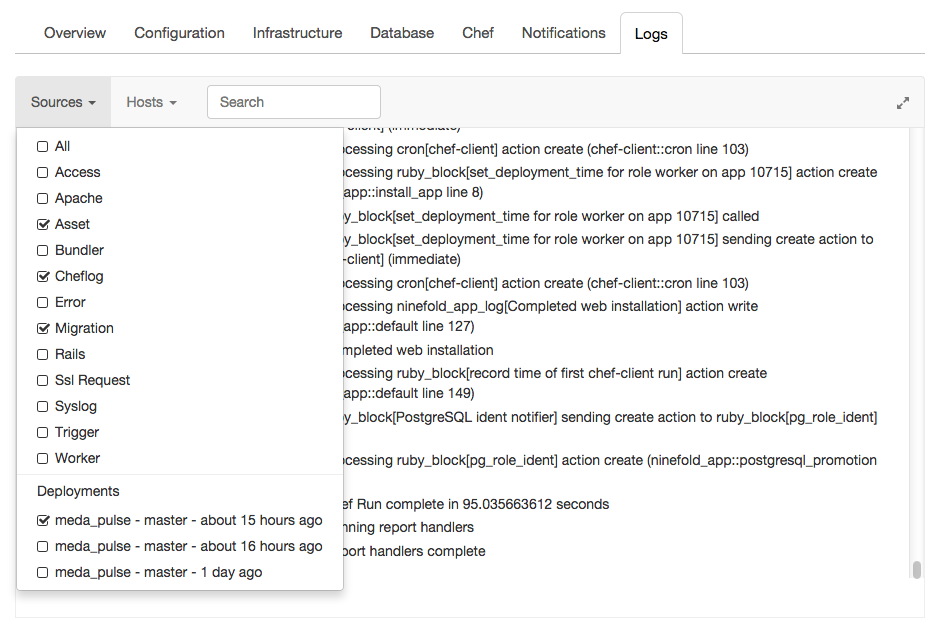
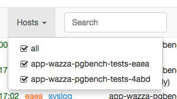

page_title:       How to Utilize Ninefold Logging
page_author:      Brittany Martin
page_description: Knowledge base article to instruct users on how they can use Ninefold logging to troubleshoot and watch usage
page_keywords:    logging CLI log troubleshoot migration asset portal rails 

## How to utilize Ninefold Rails logging

Ninefold is awfully proud of our logging system. If you want to learn how it works, check out this [blog post](https://ninefold.com/blog/2014/06/25/managing-logs-and-why-elasticsearch-is-amazing/). 

When your app is initially deployed, redeployed and serves your visitors, we're constantly logging information for you via the Ninefold Portal and CLI. 
 
*It's Log, Log, it's big, it's heavy, it's wood.*

*It's Log, Log, it's better than bad, it's good!*

*Everyone wants a log! You're gonna love it, Log!*

*Come on and get your log! Everyone needs a Log!*

This [song](https://www.youtube.com/watch?v=2C7mNr5WMjA) will be stuck in your head as you read on about Ninefold's Rails logging. 

#### Portal 

You can view your most recent logs by clicking on your __Dashboard__ > __Your App__ > __Logs__ tab. 

__Sources__

The sources drop-down will reveal the different types of logs to review. 

Logging will default to show __All__ sources (except Cheflog). The most popular ones for troubleshooting are: 

* _Apache_ - to check if the app serves a 500 error 
* _Asset_ - to view asset precompilation
* _Bundler_ - to view bundle install  
* _Cheflog_ - to track the app deployment overall
* _Rails_ -  to view real-time rails logs
* _Trigger_ - to verify pre and post migration commands and cron logging (if enabled)
* _Worker_ - to verify background worker tasks are running (ex. delayed_job, Resque, Sidekiq)  

__Deployments__

Also in the __Sources__ drop-down, you'll see the five most recent deployments within the past two - three days. To narrow the logs to a specific deployment, make sure to select that deployment only. 

__Hosts__

The Hosts (aka the servers) drop-down will reveal all of the servers that your app is deployed on. This will default to __All__ but selecting individual servers is helpful when troubleshooting a trouble host. 

__Search__ 

Ninefold logging is powered with Elasticsearch. Plug in your search term and press return to search the currently selected logs. 

__Deployment & Redeployment__

During deployment and redeployment, the app dashboard will change to have only two tabs: __Deployment__ and __Logs__. 

Navigate to the __Logs__ tab to watch the deployment run. Your deployment is complete when you see something similar to the following on each server when you select __Cheflog__:

	client.log	INFO: Chef Run complete in 96.997723217 seconds
	client.log	INFO: Running report handlers
	client.log	INFO: Report handlers complete

#### CLI

Have you installed the CLI yet? If not, Brutus the Yak is waiting for you to read over this [guide](http://help.ninefold.com/getstarted/how_to_install_and_utilize_the_cli/). There is a special section dedicated to logging. 

#### Common Deployment Mistakes 

Ninefold Rails Support Engineers are the masters of finding deployment errors. Here are some that are easy to spot in the logs (either Portal or the CLI):

__Rails logs not showing__

Check to see if you have the rails_12factor gem. If yes, please remove it, bundle locally and then redeploy. 

We ask that this gem is removed because it installs 2 subsequent gems:

rails_stdouting which sends logs to STDOUT

rails_serve_static_assets which sets config.serve_static_assets = true

Neither of these gems are necessary with Ninefold. We handle your logging merrily for you. 

__Migrations, Assets and Bundler__

Customers will see the following failed deployment error from Cheflog: 

	FATAL: Ninefold::Handler::Communicator Your app deployment on app-domain-spam-checker-master-fce0 failed for the following reason:
	==> Chef::Exceptions::Exec: deploy_revision[domain-spam-checker] (/var/chef/cache/cookbooks/application/providers/default.rb line 122) had an error: Chef::Exceptions::Exec: bash -o pipefail -c '(RAILS_ENV=production /usr/local/bin/bundle exec rake db:migrate --trace) 2>&1 | ts '[%FT%T%z]' | tee -a /var/www/apps/domain-spam-checker/shared/log/migration.log' ## && rake db:migrate returned 1, expected 0 <==

'rake db:migrate returned 1, expected 0' means that you need to click on __Sources__ and select the __Migration__ log. Scroll through these logs and look for the `rake aborted!` error. A similar error will occur with __Asset__ and __Bundler__.

__Gemfile.lock__

If you change your Gemfile and forget to bundle locally, logging will display this error: 

	client.log	ERROR: deploy_revision[10420] (/var/chef/cache/cookbooks/application/providers/default.rb line 122) had an error: Mixlib::ShellOut::ShellCommandFailed: ninefold_app_shellout[run bundle command] (/var/chef/cache/cookbooks/ninefold_app/definitions/ninefold_app_bundle_install.rb line 138) had an error: Mixlib::ShellOut::ShellCommandFailed: Expected process to exit with [0], but received '16' 
	---- Begin output of bash -o pipefail -c 'RAILS_ENV=production /usr/local/bin/bundle install --path=vendor/bundle --deployment --without development test cucumber staging --jobs 4 --retry 0 2>&1 | ts "[%FT%T%z]"' ---- 
	STDOUT: [2014-09-29T16:19:17+0000] Don't run Bundler as root. Bundler can ask for sudo if it is needed, and 
	client.log	installing your bundle as root will break this application for all non-root 
	client.log	users on this machine. 
	client.log	You are trying to install in deployment mode 	after changing 
	client.log	your Gemfile. Run `bundle install` elsewhere and add the 
	client.log	updated Gemfile.lock to version control. 

Bundle locally, recommit and redeploy the app. 

__Postgres & bringing your own database__

Another easy error to spot is database issues. 

	migration.log /var/www/apps/odotracker/releases/2f51979991b0dde203cce663a4fe1fcc2ce771a1/vendor/bundle/ruby/2.1.0/bin/rake:23:in `<main>' 
	migration.log	Gem::LoadError: pg is not part of the bundle. Add it to Gemfile. 

If your app utilizes Ninefold's database servers, the PG gem will need to be added to the Gemfile, bundled locally, committed and redeployed. 

Sometimes customers have the intention of bringing their own database (MySQL, MongoDB) and have made a mistake on the implementation so the PG gem error will occur. 

We recommend destroying the app and starting over again following this [guide](http://help.ninefold.com/apps/deploying_a_rails_app_with_your_own_database/). 

